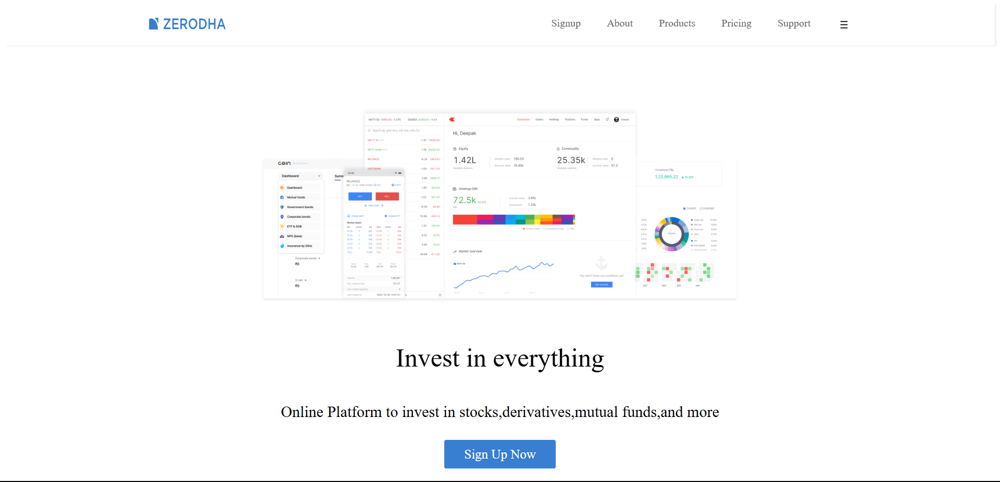

# Zerodha Homepage Clone

This is a simple clone of the Zerodha homepage built using **HTML and CSS**.

## 📷 Screenshot  


## 🌟 Features
- Clean and minimalistic UI
- Styled using inline CSS

## 🛠️ Technologies Used
- HTML5
- CSS3

## 🚀 How to Run Locally
1. Clone this repository:
   ```sh
   https://github.com/qwertiian/Zerodha-Homepage-Clone.git